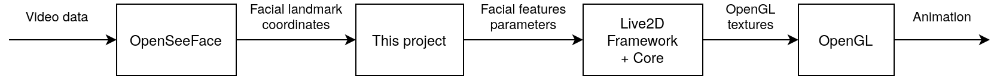

# Facial Landmarks for Cubism

A library that extracts facial landmarks from a webcam feed (computed by [OpenSeeFace](https://github.com/emilianavt/OpenSeeFace)) and converts them
into Live2D® Cubism SDK parameters.

*Disclaimer: This library is designed for use with the Live2D® Cubism SDK.
It is not part of the SDK itself, and is not affiliated in any way with Live2D
Inc. The Live2D® Cubism SDK belongs solely to Live2D Inc. You will need to
agree to Live2D Inc.'s license agreements to use the Live2D® Cubism SDK.*

This block diagram shows the intended usage of this library:

Video showing me using the example program:
<https://youtu.be/SZPEKwEqbdI>

## Old version using dlib
The old version using dlib is no longer actively maintained, but if
you want to use it, you can get it on the [dlib-stable branch](https://github.com/adrianiainlam/facial-landmarks-for-cubism/tree/dlib-stable).

## Spin-off: Mouse Tracking for Cubism

An alternative version using mouse cursor tracking and audio based lip
syncing instead of face tracking is available at
<https://github.com/adrianiainlam/mouse-tracker-for-cubism>.

The main advantage is a much lower CPU load.

## Supporting environments

This library was developed and tested only on Ubuntu 18.04 using GCC 7.5.0.

Currently it only supports Unix-like environments, as I am using
`<sys/socket.h>` etc to communicate with OpenSeeFace. If there is demand
for it, I can try to make it work on Windows as well (contributions
welcome).

The library should only require C++11. The Cubism
SDK requires C++14. I have made use of one C++17 library (`<filesystem>`)
in the example program, but it should be straightforward to change this
if you don't have C++17 support.

## Build instructions

1. Clone OpenSeeFace from <https://github.com/emilianavt/OpenSeeFace>,
   refer to its documentation and install its dependencies.

2. Install dependencies.

   You will require a recent C/C++ compiler, `make`, `patch`, and CMake >= 3.16. To compile the example
   program you will also require the OpenGL library (and its dev headers)
   among other libraries required for the example program. The libraries I
   had to install on Ubuntu 18.04 (this list may not be exhaustive) are:

       libgl1-mesa-dev libxrandr-dev libxinerama-dev libxcursor-dev libxi-dev libglu1-mesa-dev

3. Clone this repository

       git clone https://github.com/adrianiainlam/facial-landmarks-for-cubism.git

4. To build the library only: (Skip this step if you want to build the example
   program. It will be done automatically.)

       cd <path of the git repo>
       ./build.sh

To build the example program:

5. Download "Cubism 4 SDK for Native R6" from the Live2D website:
   <https://www.live2d.com/en/download/cubism-sdk/download-native/>.

   Extract the archive -- put the "CubismSdkForNative-4-r.6" folder under
   the "example" folder of this repo.

   Note: The Cubism SDK is the property of Live2D and is not part of this
   project. You must agree to Live2D's license agreements to use it.

6. Go into the
   "example/CubismSdkForNative-4-r.6/Samples/OpenGL/thirdParty/scripts"
   directory and run

       ./setup_glew_glfw

7. Go back to the "example" directory and run

       ./build.sh

8. Now try running the example program.

   First, (in a separate terminal) go to where you have downloaded
   OpenSeeFace, and run

       ./python3 ./facetracker.py -v 4 --model 3 -M

   I tried models 3 and 4, and I think both work reasonably well.
   Please feel free to explore other options provided by OSF.

   Back to the original terminal, from the "example" directory:

       cd ./demo_build/build/make_gcc/bin/Demo/
       ./Demo

## Command-line arguments for the example program

Most command-line arguments are to control the Cubism side of the program.
Only one argument (`--config`) is used to specify the configuration file
for the Facial Landmarks for Cubism library.

 * `--window-width`, `-W`: Specify the window width
 * `--window-height`, `-H`: Specify the window height
 * `--window-title`, `-t`: Specify the window title
 * `--root-dir`, `-d`: The directory at which the "Resources" folder will
   be found. This is where the model data will be located.
 * `--scale-factor`, `-f`: How the model should be scaled
 * `--translate-x`, `-x`: Horizontal translation of the model within the
   window
 * `--translate-y`, `-y`: Vertical translation of the model within the window
 * `--model`, `-m`: Name of the model to be used. This must be located inside
   the "Resources" folder.
 * `--old-param-id`, `-o`: If set to 1, translate new (Cubism 3+) parameter
   IDs to old (Cubism 2.1) IDs. This is necessary, for example, for
   [the Chitose model available from Live2D](https://www.live2d.com/en/download/sample-data/).
 * `--config`, `-c`: Path to the configuration file for the Facial Landmarks
   for Cubism library. See below for more details.

## Configuration file

Due to the differences in hardware and differences in each person's face,
I have decided to make pretty much every parameter tweakable. The file
"config.txt" lists and documents all parameters and their default values.
You can change the values there and pass it to the example program using
the `-c` argument. If using the library directly, the path to this file
should be passed to the constructor (or pass an empty string to use
default values).

## License

The library itself is provided under the MIT license. By "the library itself"
I refer to the following files that I have provided under this repo:

 * src/facial_landmark_detector.cpp
 * src/math_utils.h
 * include/facial_landmark_detector.h
 * and if you decide to build the binary for the library, the resulting
   binary file (typically build/libFacialLandmarksForCubism.a)

The license text can be found in LICENSE-MIT.txt, and also at the top of
the .cpp and .h files.

The example program is a patched version of the sample program provided
by Live2D (because there's really no point in reinventing the wheel),
and as such, as per the licensing restrictions by Live2D, is still the
property of Live2D.

The patch file (example/demo.patch) contains lines showing additions by
me, as well as deleted lines and unchanged lines for context. The deleted
and unchanged lines are obviously still owned by Live2D. For my additions,
where substantial enough for me to claim ownership, I release them under
the Do What the Fuck You Want to Public License, version 2. The full license
text can be found in LICENSE-WTFPL.txt.

All other files not mentioned above that I have provided in this repo
(i.e. not downloaded and placed here by you), *excluding* the two license
documents and files generated by Git, are also released under the Do What
the Fuck You Want to Public License, version 2, whose full license text
can be found in LICENSE-WTFPL.txt.

In order to use example program, or in any other way use this library
with the Live2D® Cubism SDK, you must agree to the license by Live2D Inc.
Their licenses can be found here:
<https://www.live2d.com/en/download/cubism-sdk/download-native/>.

This is not a license requirement, but if you find my library useful,
I'd love to hear from you! Send me an email at spam(at)adrianiainlam.tk --
replacing "spam" with the name of this repo :).

## Contributions

Contributions welcome! This is only a hobby weekend project so I don't
really have many environments / faces to test it on. Feel free to submit
issues or pull requests on GitHub, or send questions or patches to me
(see my email address above) if you prefer email. Thanks :)

